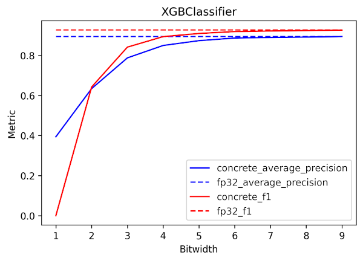

# Tree-based Models

Concrete ML provides several of the most popular `classification` and `regression` tree models that can be found in [scikit-learn](https://scikit-learn.org/stable/):

|                                                Concrete ML                                                |                                                                           scikit-learn                                                                           |
| :-------------------------------------------------------------------------------------------------------: | :--------------------------------------------------------------------------------------------------------------------------------------------------------------: |
| [DecisionTreeClassifier](../developer-guide/api/concrete.ml.sklearn.tree.md#class-decisiontreeclassifier) |     [DecisionTreeClassifier](https://scikit-learn.org/stable/modules/generated/sklearn.tree.DecisionTreeClassifier.html#sklearn.tree.DecisionTreeClassifier)     |
|  [DecisionTreeRegressor](../developer-guide/api/concrete.ml.sklearn.tree.md#class-decisiontreeregressor)  |      [DecisionTreeRegressor](https://scikit-learn.org/stable/modules/generated/sklearn.tree.DecisionTreeRegressor.html#sklearn.tree.DecisionTreeRegressor)       |
|  [RandomForestClassifier](../developer-guide/api/concrete.ml.sklearn.rf.md#class-randomforestclassifier)  | [RandomForestClassifier](https://scikit-learn.org/stable/modules/generated/sklearn.ensemble.RandomForestClassifier.html#sklearn.ensemble.RandomForestClassifier) |
|   [RandomForestRegressor](../developer-guide/api/concrete.ml.sklearn.rf.md#class-randomforestregressor)   |  [RandomForestRegressor](https://scikit-learn.org/stable/modules/generated/sklearn.ensemble.RandomForestRegressor.html#sklearn.ensemble.RandomForestRegressor)   |

Concrete ML also supports [XGBoost](https://xgboost.ai/)'s `XGBClassifier`:

|                                      Concrete ML                                       |                                                XGboost                                                 |
| :------------------------------------------------------------------------------------: | :----------------------------------------------------------------------------------------------------: |
| [XGBClassifier](../developer-guide/api/concrete.ml.sklearn.xgb.md#class-xgbclassifier) | [XGBClassifier](https://xgboost.readthedocs.io/en/stable/python/python_api.html#xgboost.XGBClassifier) |
|  [XGBRegressor](../developer-guide/api/concrete.ml.sklearn.xgb.md#class-xgbregressor)  |  [XGBRegressor](https://xgboost.readthedocs.io/en/stable/python/python_api.html#xgboost.XGBRegressor)  |


For a formal explanation of the mechanisms that enable FHE-compatible decision trees, please see the following paper: [Privacy-Preserving Tree-Based Inference with Fully Homomorphic Encryption, arXiv:2303.01254](https://arxiv.org/abs/2303.01254)



As the maximum depth parameter of decision trees and tree-ensemble models strongly increases the number of nodes in the trees, we recommend
using the XGBoost models which achieve better performance with lower depth.


## Example

Here's an example of how to use this model in FHE on a popular data-set using some of scikit-learn's pre-processing tools. A more complete example can be found in the [XGBClassifier notebook](ml_examples.md).

```python
from sklearn.datasets import load_breast_cancer
from sklearn.decomposition import PCA
from sklearn.model_selection import GridSearchCV, train_test_split
from sklearn.pipeline import Pipeline
from sklearn.preprocessing import StandardScaler

from concrete.ml.sklearn.xgb import XGBClassifier


# Get data-set and split into train and test
X, y = load_breast_cancer(return_X_y=True)

# Split the train and test set
X_train, X_test, y_train, y_test = train_test_split(X, y, test_size=0.2, random_state=0)

# Define our model
model = XGBClassifier(n_jobs=1, n_bits=3)

# Define the pipeline
# We normalize the data and apply a PCA before fitting the model
pipeline = Pipeline(
    [("standard_scaler", StandardScaler()), ("pca", PCA(random_state=0)), ("model", model)]
)

# Define the parameters to tune
param_grid = {
    "pca__n_components": [2, 5, 10, 15],
    "model__max_depth": [2, 3, 5],
    "model__n_estimators": [5, 10, 20],
}

# Instantiate the grid search with 5-fold cross validation on all available cores
grid = GridSearchCV(pipeline, param_grid, cv=5, n_jobs=-1, scoring="accuracy")

# Launch the grid search
grid.fit(X_train, y_train)

# Print the best parameters found
print(f"Best parameters found: {grid.best_params_}")

# Output:
#  Best parameters found: {'model__max_depth': 5, 'model__n_estimators': 10, 'pca__n_components': 5}

# Currently we only focus on model inference in FHE
# The data transformation is done in clear (client machine)
# while the model inference is done in FHE on a server.
# The pipeline can be split into 2 parts:
#   1. data transformation
#   2. estimator
best_pipeline = grid.best_estimator_
data_transformation_pipeline = best_pipeline[:-1]
model = best_pipeline[-1]

# Transform test set
X_train_transformed = data_transformation_pipeline.transform(X_train)
X_test_transformed = data_transformation_pipeline.transform(X_test)

# Evaluate the model on the test set in clear
y_pred_clear = model.predict(X_test_transformed)
print(f"Test accuracy in clear: {(y_pred_clear == y_test).mean():0.2f}")

# In the output, the Test accuracy in clear should be > 0.9

# Compile the model to FHE
model.compile(X_train_transformed)

# Perform the inference in FHE
# Warning: this will take a while. It is recommended to run this with a very small batch of
# example first (e.g., N_TEST_FHE = 1)
# Note that here the encryption and decryption is done behind the scene.
N_TEST_FHE = 1
y_pred_fhe = model.predict(X_test_transformed[:N_TEST_FHE], fhe="execute")

# Assert that FHE predictions are the same as the clear predictions
print(f"{(y_pred_fhe == y_pred_clear[:N_TEST_FHE]).sum()} "
      f"examples over {N_TEST_FHE} have an FHE inference equal to the clear inference.")

# Output:
#  1 examples over 1 have an FHE inference equal to the clear inference
```

Similarly, the decision boundaries of the Concrete ML model can be plotted and compared to the results of the classical XGBoost model executed in the clear. A 6-bit model is shown in order to illustrate the impact of quantization on classification. Similar plots can be found in the [Classifier Comparison notebook](ml_examples.md).


## Quantization parameters

This graph above shows that, when using a sufficiently high bit-width, quantization has little impact on the decision boundaries of the Concrete ML FHE decision tree models. As quantization is done individually on each input feature, the impact of quantization is strongly reduced. This means that FHE tree-based models reach a similar level of accuracy as their floating point equivalents. Using 6 bits for quantization means that the Concrete ML model reaches, or exceeds, the floating point accuracy. The number of bits for quantization can be adjusted through the `n_bits` parameter.

When `n_bits` is set to a low value, the quantization process may sometimes create some artifacts that could lead to a decrease in accuracy. At the same time, the execution speed in FHE could improve. In this way, it is possible to adjust the accuracy/speed trade-off, and some accuracy can be recovered by increasing the `n_estimators` parameter.

The following graph shows that using 5-6 bits of quantization is usually sufficient to reach the performance of a non-quantized XGBoost model on floating point data. The metrics plotted are accuracy and F1-score on the `spambase` data-set.



## FHE Inference time considerations

The inference time in FHE is strongly dependant on the maximum circuit bit-width. For trees, in most cases, the quantization bit-width
will be the same as the circuit bit-width. Therefore, reducing the quantization bit-width to 4 or less will result in fast inference times.
Adding more bits will increase FHE inference time exponentially.

In some rare cases, the bit-width of the circuit can be higher than the quantization bit-width. This could happen when the quantization bit-width is low but the tree-depth is high. In such cases, the circuit bit-width is upper bounded by `ceil(log2(max_depth + 1) + 1)`.

For more information on the inference time of FHE decision trees and tree-ensemble models please see [Privacy-Preserving Tree-Based Inference with Fully Homomorphic Encryption, arXiv:2303.01254](https://arxiv.org/abs/2303.01254).
