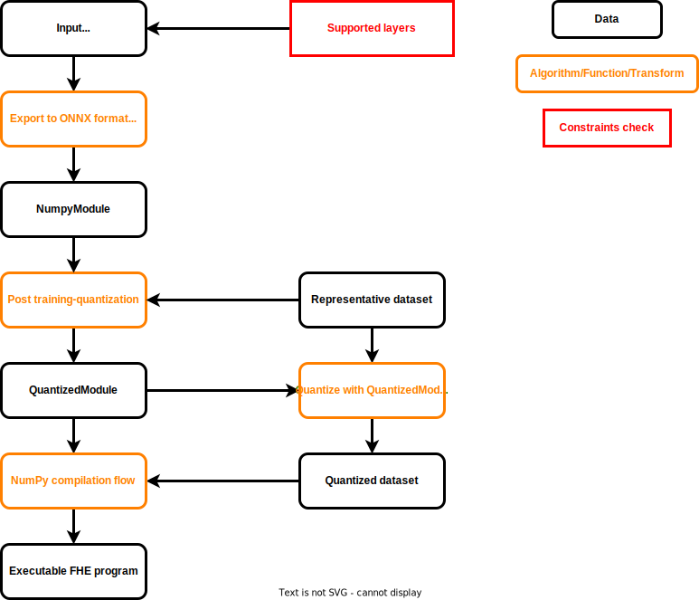

# ONNX usage in **Concrete ML**

It was decided to use ONNX as the format to convert torch nn.Modules to numpy. The reason being that converting/interpreting torchscript would require a lot of effort while ONNX has tools readily available to easily manipulate the model's representation in numpy. In addition JAX had an example of a lightweight interpreter to run ONNX models as numpy code.

## Steps of the conversion and compilation of a torch model to numpy via ONNX

In the diagram above it is perfectly possible to stop at the `NumpyModule` level if you just want to run the torch model as numpy code without doing quantization.

The `NumpyModule` stores the ONNX model that it interprets. The interpreter works by going through the ONNX graph (which by specification is sorted in [topological order](https://en.wikipedia.org/wiki/Topological_sorting) allowing to just run through the graph without having to care for evaluation order) and storing the intermediate results as it goes. To execute a node the interpreter feeds the required inputs (taken either from the model inputs or the intermediate results) to the numpy implementation of each ONNX node.

The post training quantization process uses the ONNX model stored in the `NumpyModule` and interprets it in a very similar way to the forward function of the `NumpyModule` itself. First initializers (ONNX's parameters) are quantized according to `n_bits` passed to the post training quantization process. During the interpretation/execution for post training quantization, the quantized version of the operators are used, constant inputs (parameters or otherwise) are passed to the quantized operators which then decide on how to use the constants.

## How to use `QuantizedOp`

`QuantizedOp` is the base class for all ONNX quantized operators. It abstracts away a lot of things to allow to easily implement new quantized ops.

### Case: we already have a numpy implementation of an ONNX operator.

You can check `ops_impl.py` to see how implementation are done in numpy. The requirements are as follow:

- The required inputs should be positional arguments only before the `/` which marks the limit of the positional arguments
- The optional inputs should be positional or keyword arguments between the `/` and `*` which marks the limits of positional or keyword arguments
- The operator attributes should be keyword arguments only after the `*`

The proper use of positional/keyword arguments is required to allow the `QuantizedOp` class to properly populate metadata automatically. It uses the python inspect modules and stores relevant information for each argument related to its positional/keyword status. This allows us to use our numpy implementation as specifications for `QuantizedOp` which removes some data duplication and allows us to have a single source of truth for `QuantizedOp` and ONNX numpy implementations.

In that case (unless the quantized implementation requires special handling like `QuantizedGemm`) you can just set `_impl_for_op_named` to the name of the ONNX op for which the quantized class is implemented (this uses the mapping `ONNX_OPS_TO_numpy_IMPL` we have in `onnx_utils.py` to get the right implementation).

### Case: we need an alternative implementation of an ONNX operator/we don't have such an implementation.

If you want to provide an alternative implementation you can set `_impl_for_op_named` to the name of the operator you are providing an alternative implementation (e.g. `Exp`) and you can set `impl` and/or `q_impl` to the functions that will do the alternative handling. `QuantizedGemm` is an example of such a case where quantized matrix multiplication requires proper handling of scales and zero points, the `q_impl` of that class reflects that.
