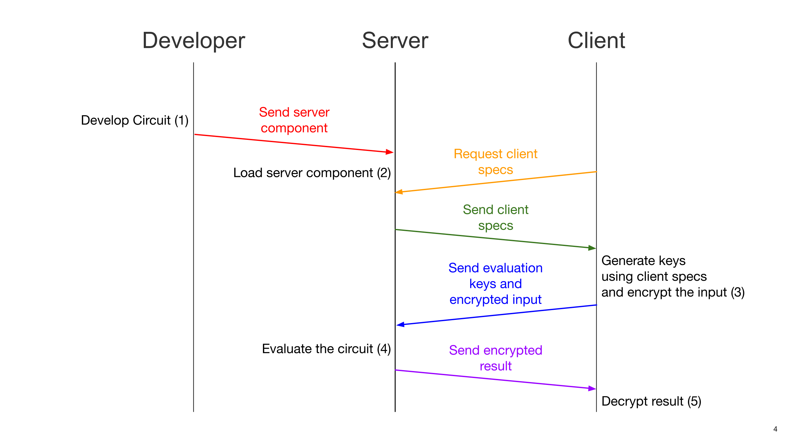

# Inference in the Cloud

Concrete-ML models can be easily deployed in a client/server setting, enabling the creation
of privacy-preserving services in the cloud.

As seen in the [concepts section](../getting-started/concepts.md), a Concrete-ML model, once
compiled to FHE, generates machine code that performs the inference on private data. Furthermore,
_secret_ encryption keys are needed so that the user can securely encrypt their data and decrypt the inference
result. An _evaluation_ key is also needed for the server to securely process the user's encrypted data.

Keys are generated by the user _once_ for each service they use, based on the model the service provides
and its cryptographic parameters.

The overall communications protocol to enable cloud deployment of machine learning services can be
summarized in the following diagram:

The steps detailed above are the following:

1. The model developer deploys the compiled machine learning model to the server. This model includes the cryptographic parameters. The server is now ready to provide private inference
1. The client requests the cryptographic parameters (also called "client specs"), and once it gets them from the server, generates the _secret_ and _evaluation_ keys.
1. The client sends the _evaluation_ key to the server. The server is now ready to accept requests from this client. The client sends their encrypted data.
1. The server uses the _evaluation_ key to securely run inference on the the user's data and sends back the encrypted result.
1. The client now decrypts the result and can send back new requests.

For more information on how to implement this basic secure inference protocol, refer to the [Production Deployment section](../advanced-topics/client_server.md) and to the [client/server example](https://github.com/zama-ai/concrete-ml/blob/release/0.3.x/docs/advanced_examples/ClientServer.ipynb).
