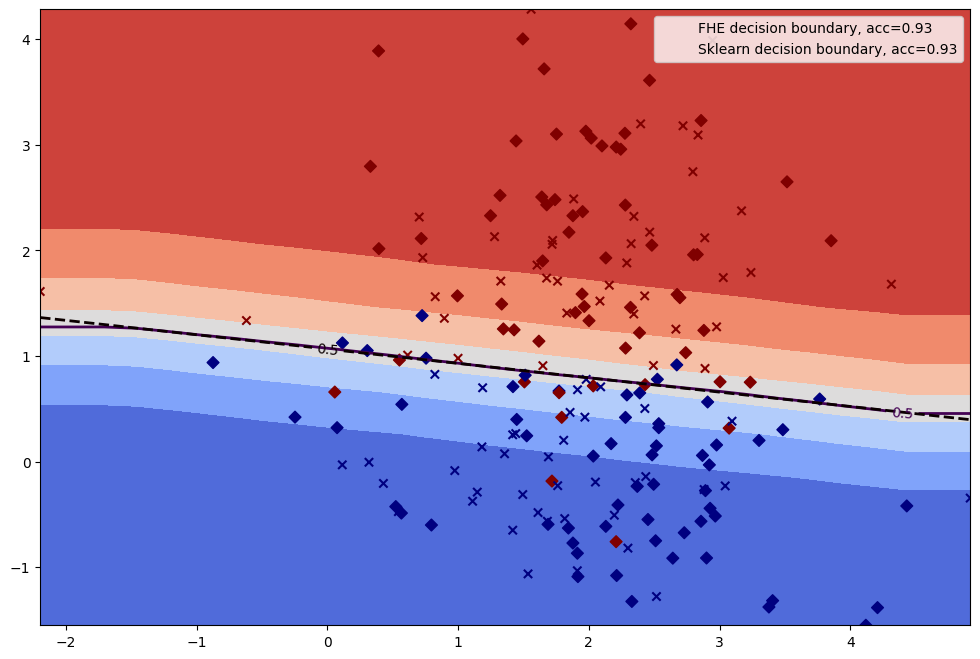
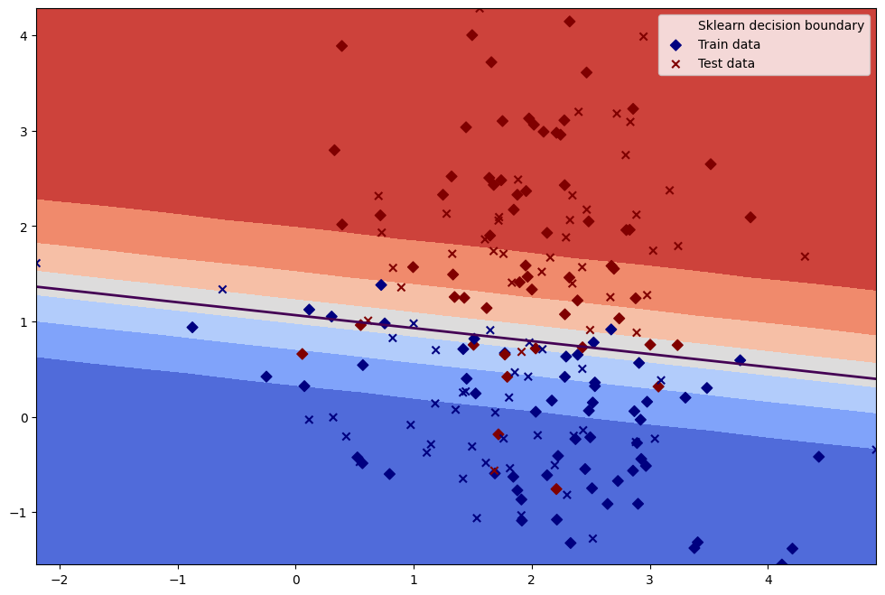

# Linear Models

## Scikit-learn

**Concrete-ML** provides several of the most popular linear models for `regression` or `classification` that can be found in [scikit-learn](https://scikit-learn.org/stable/):

|                                                          Concrete-ML                                                          |                                                                         scikit-learn                                                                         |
| :---------------------------------------------------------------------------------------------------------------------------: | :----------------------------------------------------------------------------------------------------------------------------------------------------------: |
|  [LinearRegression](_apidoc/concrete.ml.sklearn.html?highlight=regression#concrete.ml.sklearn.linear_model.LinearRegression)  |    [LinearRegression](https://scikit-learn.org/stable/modules/generated/sklearn.linear_model.LinearRegression.html#sklearn.linear_model.LinearRegression)    |
| [LogisticRegression](_apidoc/concrete.ml.sklearn.html?highlight=logistic#concrete.ml.sklearn.linear_model.LogisticRegression) | [LogisticRegression](https://scikit-learn.org/stable/modules/generated/sklearn.linear_model.LogisticRegression.html#sklearn.linear_model.LogisticRegression) |
|                 [LinearSVC](_apidoc/concrete.ml.sklearn.html?highlight=svc#concrete.ml.sklearn.svm.LinearSVC)                 |                       [LinearSVC](https://scikit-learn.org/stable/modules/generated/sklearn.svm.LinearSVC.html#sklearn.svm.LinearSVC)                        |
|                 [LinearSVR](_apidoc/concrete.ml.sklearn.html?highlight=svc#concrete.ml.sklearn.svm.LinearSVR)                 |                       [LinearSVR](https://scikit-learn.org/stable/modules/generated/sklearn.svm.LinearSVR.html#sklearn.svm.LinearSVR)                        |
|                 [PoissonRegressor](_apidoc/concrete.ml.sklearn.html#concrete.ml.sklearn.glm.PoissonRegressor)                 |    [PoissonRegressor](https://scikit-learn.org/stable/modules/generated/sklearn.linear_model.PoissonRegressor.html#sklearn.linear_model.PoissonRegressor)    |
|                 [TweedieRegressor](_apidoc/concrete.ml.sklearn.html#concrete.ml.sklearn.glm.TweedieRegressor)                 |    [TweedieRegressor](https://scikit-learn.org/stable/modules/generated/sklearn.linear_model.TweedieRegressor.html#sklearn.linear_model.TweedieRegressor)    |
|                   [GammaRegressor](_apidoc/concrete.ml.sklearn.html#concrete.ml.sklearn.glm.GammaRegressor)                   |       [GammaRegressor](https://scikit-learn.org/stable/modules/generated/sklearn.linear_model.GammaRegressor.html#sklearn.linear_model.GammaRegressor)       |
|                                                                                                                               |                                                                                                                                                              |

Using those models in FHE is extremely similar to what can be done with scikit-learn's [API](https://scikit-learn.org/stable/modules/classes.html#module-sklearn.linear_model). Any data scientists that are used to this framework should find the FHE tools very straightforward. More details about compiling and running any simple models can be found [here](simple_compilation.md).

Models from **Concrete-ML** are also compatible with some of scikit-learn's main worflows, such as `Pipeline()` or `GridSearch()`.

## Training and predicting with Concrete-ML

All of the **training process is handled by scikit-learn**. Therefore, any users should refer to scikit-learn's documentation considering details and parameters about the training part. **Concrete-ML** enables executing the trained model's inferences on encrypted data using FHE.

## Example

Here's an example of how to use this model in FHE on a simple dataset below. A more complete example can be found in the [LogisticRegression notebook](advanced_examples.md). Additionally, a similar example using some of scikit-learn's most popular preprocessing tools is available in the documentation about [tree models](tree.md).

```python
import numpy
from sklearn.datasets import make_classification
from sklearn.model_selection import train_test_split

from concrete.ml.sklearn import LogisticRegression

# Create the data for classification
X, y = make_classification(
    n_features=2,
    n_redundant=0,
    n_informative=2,
    random_state=2,
    n_clusters_per_class=1,
    n_samples=100,
)

# Retrieve train and test sets
X_train, X_test, y_train, y_test = train_test_split(X, y, test_size=0.4, random_state=42)

# Instantiate the model
model = LogisticRegression(n_bits=2)

# Fit the model
model.fit(X_train, y_train)

# Evaluate the model on the test set in clear
y_pred_clear = model.predict(X_test)

# Compile the model
model.compile(X_train)

# Perform the inference in FHE
# Warning: this will take a while. It is recommended to run this with a very small batch of
# example first (e.g. N_TEST_FHE = 1)
# Note that here the encryption and decryption is done behind the scene.
N_TEST_FHE = 1
y_pred_fhe = model.predict(X_test[:N_TEST_FHE], execute_in_fhe=True)

# Assert that FHE predictions are the same as the clear predictions
print(f"{(y_pred_fhe == y_pred_clear[:N_TEST_FHE]).sum()} "
      f"examples over {N_TEST_FHE} have a FHE inference equal to the clear inference.")

# Output:
#  1 examples over 1 have a FHE inference equal to the clear inference
```

## Visual comparison

Using the above example, we can then plot how the model classifies the inputs and then compare those results with a scikit-learn model executed in clear.
The complete code can be found in the [LogisticRegression notebook](advanced_examples.md).

Let's plot the decision boundaries of both model.

### Classification Decision Boundaries

|  |  |
| :-------------------------------------------------------------: | :-----------------------------------------------------------------: |
|                     *Concrete-ML FHE model*                     |                     *scikit-learn clear model*                      |
|                                                                 |                                                                     |

We can clearly observe the impact of quantization over the decision boundaries in the FHE model, breaking the initial lines into broken lines with steps. However, this does not change the overall score as both models output the same accuracy (90%).

In fact, the quantization process may sometimes create some artifacts that could lead to a decrease in performance. Still, the impact of those artifacts is often minor when considering linear models, making FHE models reach similar scores as their equivalent clear ones.
